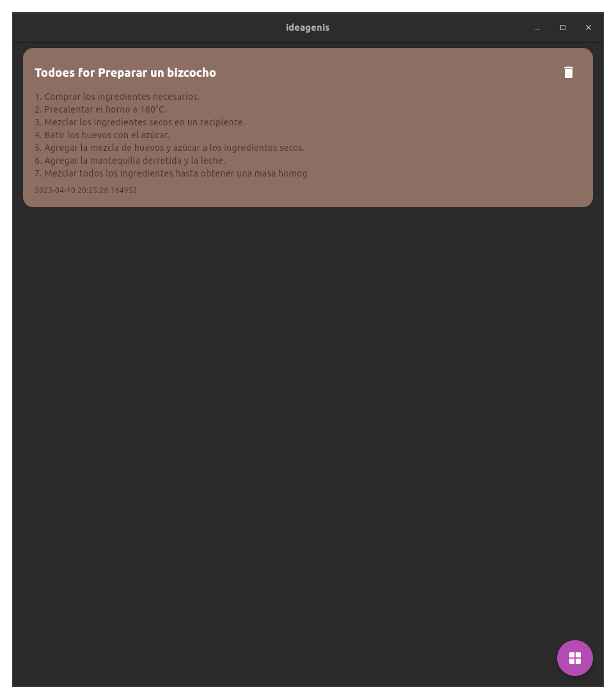
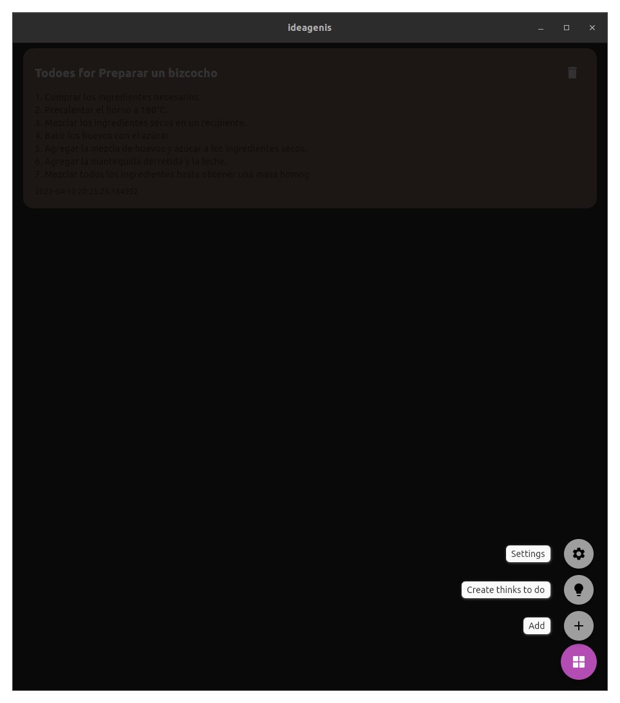
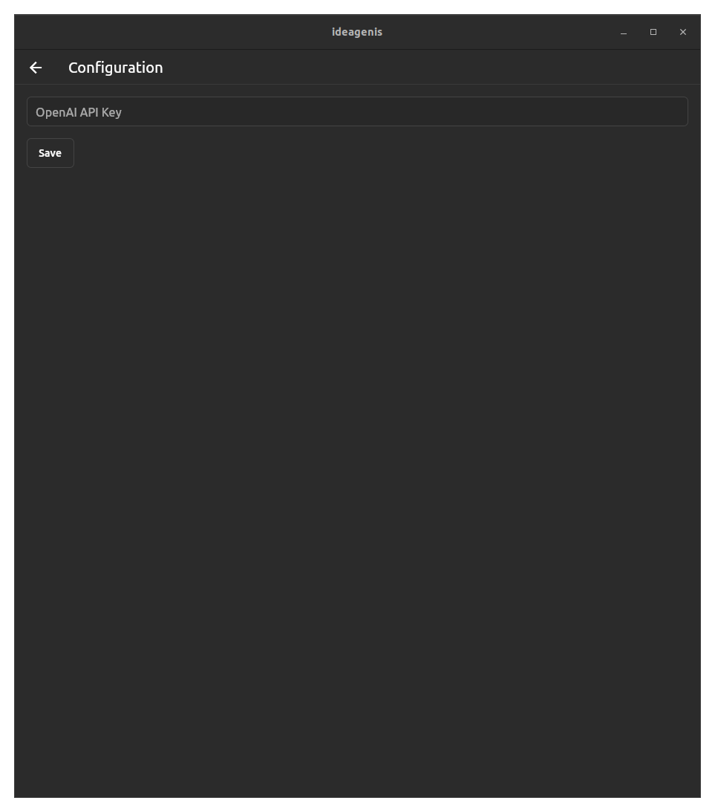

# IdeaGenius

IdeaGenius es una aplicación de notas intuitiva y elegante para guardar tus ideas y pensamientos. Desarrollada con Flutter, esta aplicación multiplataforma te permite llevar tus ideas contigo en cualquier dispositivo y sistema operativo.

<!-- GRID SCREENSHOTS RESPONSIVE -->
<div style="display: flex; flex-direction: row; justify-content: space-between;">
  
  
  
  
</div>

## Características

- Crear, editar y eliminar notas
- Elegir colores al azar para tus notas
- Diseño minimalista y fácil de usar
- Compatible con múltiples plataformas (iOS, Android, Web)

## Instalación

Para instalar IdeaGenius, sigue estos pasos:

1. Clona el repositorio en tu máquina local:

2. Navega hasta el directorio del proyecto e instala las dependencias:

```bash
flutter pub get
```

3. Ejecuta la aplicación en tu dispositivo/emulador:

```bash
flutter run
```


## Contribuciones

IdeaGenius es un proyecto de código abierto y nos encantaría que te unas a nosotros para mejorarlo. Si te gustaría contribuir, aquí hay algunas ideas:

- Reportar errores y solicitar nuevas funcionalidades a través de [issues](https://github.com/erxonxi/ideagenius/issues)
- Mejorar la experiencia del usuario (UI/UX)
- Implementar nuevas funcionalidades y solucionar problemas existentes
- Mejorar la documentación y agregar traducciones

No dudes en enviar un Pull Request o abrir un Issue para discutir tus ideas.

## Licencia

IdeaGenius está licenciado bajo la licencia [MIT](https://github.com/erxonxi/ideagenius/blob/main/LICENSE).


